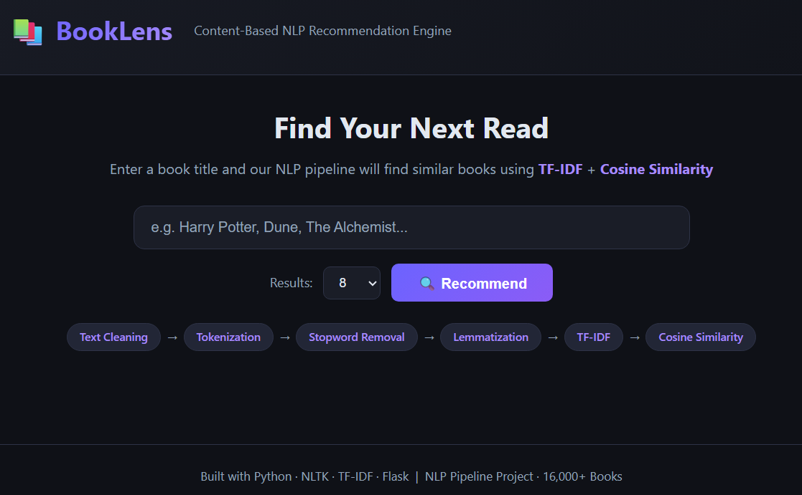

<div align="center">

# 📚 Shelf Sense — Book Recommendation System

### *Because your next favorite book shouldn't be a coin flip.*

<!-- 🖼️ Banner Placeholder -->
<!-- Drop a 1280x640 banner here, e.g. static/banner.png -->


<em>A content-based recommendation engine that reads between the lines — literally — using NLP to understand what makes a book *feel* like another book, then finds you more of exactly that.</em>

<br/>

[](https://book-recommendation-system-l2x7.onrender.com)

</div>

<div align="center">


</div>

---

## 🚀 Live Demo

> 🟢 The app is live and ready to recommend. No installs, no waiting — just type a book title and go.

<div align="center">

### 👉 **[book-recommendation-system-l2x7.onrender.com](https://book-recommendation-system-l2x7.onrender.com)** 👈

</div>

> ⚠️ **Note:** This project is hosted on Render's free tier. If the service has been idle, the first request may take **30–60 seconds** to spin up. Grab a coffee ☕ — your recommendations are worth the wait.

---

## ✨ Key Features

| | Feature | Description |
|---|---|---|
| 🔍 | **Smart Search & Autocomplete** | Start typing a title and get instant, fuzzy-matched suggestions — no need to remember the exact spelling. |
| 🧠 | **NLP-Powered Recommendations** | Uses natural language processing (NLTK + Gensim) to understand book descriptions/metadata at a semantic level, not just keyword matching. |
| 📐 | **Content-Based Similarity Engine** | Leverages `scikit-learn` to compute similarity scores (cosine similarity over vectorized features) between books and surface the closest matches. |
| ⚡ | **Fast, Lightweight API** | A clean Flask backend with dedicated endpoints for recommendations, autocomplete, and health checks — built for responsiveness. |
| 🎯 | **Configurable Result Count** | Ask for exactly as many recommendations as you want (`top_n`), tailored per request. |
| 💻 | **Minimal, Clean UI** | A distraction-free frontend (HTML/CSS/JS) focused entirely on getting you from *"I loved this book"* to *"I need to read that next."* |
| ☁️ | **Production-Ready Deployment** | Shipped with `gunicorn` and a `/health` endpoint so platforms like Render can monitor uptime and keep the app alive. |
| 📓 | **Transparent ML Workflow** | Includes Jupyter notebooks documenting the full data exploration, cleaning, and model-building pipeline — nothing is a black box. |

---

## 🛠️ Tech Stack

<table>
<tr>
<td valign="top" width="25%">

### 🎨 Frontend
- HTML5
- CSS3
- Vanilla JavaScript
- Jinja2 Templates (Flask)

</td>
<td valign="top" width="25%">

### ⚙️ Backend
- Python 3
- Flask
- Gunicorn (WSGI server)

</td>
<td valign="top" width="25%">

### 🤖 Machine Learning / NLP
- scikit-learn (cosine similarity, vectorization)
- NLTK (text preprocessing)
- Gensim (word/topic embeddings)
- Pickle (model persistence)

</td>
<td valign="top" width="25%">

### 📊 Data & Analysis
- Pandas & NumPy
- Matplotlib & Seaborn
- Jupyter Notebooks

</td>
</tr>
</table>

> 💡 The core intelligence lives in `src/nlp_pipeline.py`, where a `BookRecommender` class handles text preprocessing, vectorization, and similarity scoring — trained via `train.py` and served through the Flask API in `app.py`.

---

## 🏗️ Project Architecture

```
Book-Recommendation-System/
├── data/            # Raw & processed book datasets
├── model/           # Serialized (pickled) trained recommender model
├── notebooks/        # EDA & model-building Jupyter notebooks
├── src/             # Core NLP pipeline & recommender logic
├── static/          # CSS, JS, and image assets
├── templates/        # HTML (Jinja2) templates
├── app.py           # Flask application & API routes
├── requirements.txt # Python dependencies
└── README.md
```

---

## ⚡ Getting Started / Installation

Want to run **Shelf Sense** on your own machine? Follow along 👇

### ✅ Prerequisites
- Python **3.10+**
- `pip` (Python package manager)
- Git

### 📥 1. Clone the Repository

```bash
git clone https://github.com/Sahil-Dev404/Book-Recommendation-System.git
cd Book-Recommendation-System
```

### 🐍 2. Create a Virtual Environment (recommended)

```bash
python -m venv venv

# Activate it
# On macOS/Linux:
source venv/bin/activate
# On Windows:
venv\Scripts\activate
```

### 📦 3. Install Dependencies

```bash
pip install -r requirements.txt
```

### 🧠 4. Run the App

```bash
python app.py
```

> On first run, if no trained model is found at `model/recommender.pkl`, the app will **automatically train one** from the dataset in `data/` before starting up.

### 🌐 5. Open in Browser

Head to:

```
http://localhost:5000
```

That's it — you're up and running! 🎉

---

## 📖 Usage

1. **Open the app** — either the [live demo](https://book-recommendation-system-l2x7.onrender.com) or your local instance.
2. **Type a book title** into the search bar — an autocomplete dropdown will help you find the exact match.
3. **Hit "Recommend"** — the engine analyzes the book's content and instantly returns a curated list of similar titles.
4. **Explore** — browse the recommended books and repeat the process with any new title that catches your eye.

<details>
<summary>🔌 API Reference (for developers)</summary>

| Method | Endpoint | Description |
|--------|----------|-------------|
| `GET` | `/` | Serves the main frontend page |
| `POST` | `/recommend` | Accepts `{ "title": "...", "top_n": 8 }` and returns a JSON list of recommended books |
| `GET` | `/autocomplete?q=...` | Returns JSON title suggestions for a partial query |
| `GET` | `/health` | Health check endpoint — returns app status and total books loaded |

</details>

---

## 📸 Screenshots

<div align="center">

<!-- Replace the placeholders below with real screenshots -->

### 🏠 Home Page


### 🔍 Search in Action


### 📚 Recommendations Result


</div>

> 📁 *Add your screenshots to `static/screenshots/` and update the paths above.*

---

## 🤝 Contributing

Contributions, issues, and feature requests are always welcome! This project thrives on community input.

> 💬 *Got an idea? Found a bug? Open an issue — let's talk about it.*

1. **Fork** the repository
2. **Create** your feature branch
   ```bash
   git checkout -b feature/AmazingFeature
   ```
3. **Commit** your changes
   ```bash
   git commit -m "Add: AmazingFeature"
   ```
4. **Push** to the branch
   ```bash
   git push origin feature/AmazingFeature
   ```
5. **Open a Pull Request** 🚀

### 📝 Contribution Guidelines
- Keep code clean and well-commented.
- Test your changes locally before submitting a PR.
- Update documentation if your change affects usage or setup.

---

## 📄 License

This project is licensed under the **MIT License**.

> See the [`LICENSE`](./LICENSE) file for full details. Feel free to use, modify, and distribute — just give credit where it's due. 🙌

---

## 👤 Author & Contact

<div align="center">

### **Sahil**

Built with ☕, curiosity, and a genuine love for books.

[](https://github.com/Sahil-Dev404)

</div>

---

<div align="center">

### ⭐ If this project helped you discover your next great read, consider giving it a star!

<em>Built with Python, powered by NLP, and dedicated to book lovers everywhere.</em>

</div>